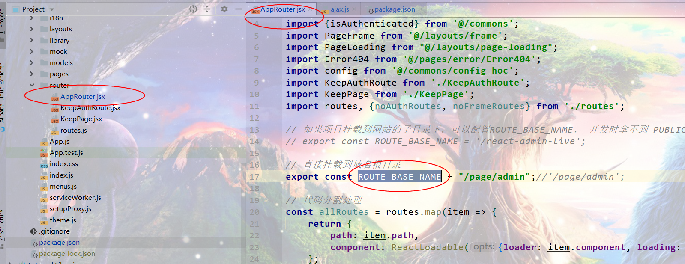
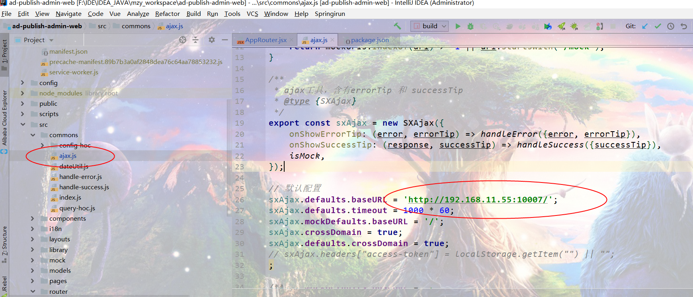

# 介绍

- 谷瓜

### 软件架构

 1、使用技术：
    
    spring boot :2.1.4.RELEASE
    springcloud :Greenwich.SR1
    mybatis-plus:3.0.7.1
    redis:5.0.5  开发 （ 3.0.503）
    mysql : 8.0
    jdk: 1.8
    
 2、项目目录结构：
    
    common-item-config：服务模块公共配置
    
    common-item-constant：服务模块常量
    
    common-item-util：服务模块集成工具包
    db： 数据库文件：
           初始化数据库，
           清除数据数据库脚本
            
    img:说明文档引入图片
    
    doc: 项目文档等资料存放目录
    
    log:日志目录
   
    project-platform-item: 党建管理系统
    
  
  
  
 4、项目登陆权限校验 (基于拦截器)(权限平台)
    
    使用技术：redis+JWT 
    
    具体方法： 
        1。用户登陆后生成 jwt token 信息，每次 生成 token 信息都不一样
        2。存储到redis 中，设置超时
        3。用户登陆成功后，返回前端token 信息
        4。前端请求接口 时 把 token 放入 heder 头中
        5。每次请求，通过拦截器校验 token 信息
        6。登陆状态
           未登录：拦截器中获取不到 token  信息 则用户未登陆
           单设备登录：请求头中获取的 token信息 与 redis 中存储的不一致 则用户已在其他地方登陆
           登陆超时：redis 中 获取不到用户的 token 信息，则用户登陆超时
            
   .jpg)
   
    
 5、项目启动顺序
 
```
  
```

 

## 安装教程
#### 单个服务安装教程：
- 1、搭建服务器环境 
    - 1：到 `https://oneinstack.com/` 网站自定义安装包 （数据库，redis ,jdk ,nginx）
    - 2:服务器上执行从上面网站复制的 命令：    
        `wget -c http://mirrors.linuxeye.com/oneinstack-full.tar.gz && tar xzf oneinstack-full.tar.gz && ./oneinstack/install.sh --nginx_option 1 --jdk_option 2 --db_option 4 --dbinstallmethod 1 --dbrootpwd oneinstack --redis  --reboot`
- 2、创建数据库：db下初始化数据库导入

- 3、服务器上创建项目目录 文件

    - 1：静态资源目录：/home/project/（项目名）/staticFile
    - 2：配置文件目录：/home/project/（项目名）/config
    - 3: 日志目录：/home/project/（项目名）/log
    - 4：启动脚本：
        - 把doc 文件下的shell 脚本 放入 /home/project/（项目名）/ 目录下
        - 修改脚本名字为：charge.sh
        - 修改启动脚本为可执行：chmod 777  xxx.sh
        - 修改脚本文件里启动项目名字： 为 xxx.jar
        
    .jpg)   
- 4、把服务打包成 jar 包 修改名字 为 xxx.jar  上传到服务器 /home/project/（项目名）/ 目录下 
     - 启动项目 ： ./charge.sh  restart 
     - 查看实时日志： tail -f ./log/catalina.out 
       
- 5、上传静态资源 前端文件 到服务器  /home/project/（项目名）/staticFile/目录下
    - 1、该目录下如果创建后台管理页面目录  admin(或其他名字)  则把静态页面放到 admin 目录下
        - 访问路径为：http://ip:端口/admin/index.html
    - 2、如果index.html 在  /home/project/（项目名）/staticFile/ 目录下
        - 项目访问路径为：http://ip:端口/index.html
    - 3、可在 /home/project/staticFile/ 下创建多个项目的静态资源文件目录，
        - 访问路径为：http://ip:端口/静态资源文件目录/index.html
        
- 注：静态资源（react-admin项目）单独部署（nginx做web服务）
    - 部署目录与 第五个步骤一样  springboot项目 里可以不需要配置相关静态资源路径
        
     -  nginx 配置前端页面示例 server 配置（项目目录可修改为自己项目路径）：
        
         ```Conf
            
           server {
            listen       8001;
            server_name  0.0.0.0;
            # 总管理后台 配置路由
            location /page/admin {
             root /home/project/ad_publish_10007/ad_publish_admin/staticFile/;
             #加上了这个，就可以在url后面直接加路由上配置path了。
             try_files $uri /page/admin/index.html;
             index index.html index.htm;
            }
            # 广告机后台配置路由
            location /page/adpublish {
                 root  /home/project/ad_publish_10007/ad_publish_admin/staticFile/;
                 #加上了这个，就可以在url后面直接加路由上配置path了。
                 try_files $uri /page/adpublish/index.html;
                 index index.html index.htm;
            }
            # 官网配置路由
            location / {
                 root  /home/project/ad_publish_10007/ad_publish_admin/staticFile/;
                 index index.html index.htm;
            }
            
            # 服务端请求数据接口
            location ^~/api/{
                # 使用真实ip
                proxy_set_header X-Real-IP $remote_addr;
                proxy_set_header REMOTE-HOST $remote_addr;
                proxy_set_header X-Forwarded-For $proxy_add_x_forwarded_for;
        
                proxy_set_header Host $host;
                proxy_set_header Upgrade $http_upgrade;
                proxy_set_header Connection "upgrade";
                proxy_pass http://127.0.0.1:10007/;
            }
         }
         ```
         
     - 前端页面打包 可选择增加对应的挂载目录路径，
       - 例：总共管理后台
         - 打包配置 package.json 添加 homepage:"/page/admin"
         - appRouter 添加基礎路徑
         
            
         
         - 服務端接口修改 
         
            
         
         - 结束打包上传
        
- 6、修改配置文件：把`/src/main/resources/application*` 配置文件上传到 服务器 `/home/project/（项目名）/config` 目录下 修改配置文件：application-dev.yml
    - 1、修改端口及压缩率
        ```YAML
        server:
          #修改端口
          port: 10007
          #配置 结果压缩
          compression:
            enabled: true
            mime-types: application/json,application/xml,text/html,text/xml,text/plain,text/css,application/javascript,image/png
            min-response-size: 50KB
        ```
    - 2、修改 redis 及mysql 配置
        ```YAML
        spring:
          application:
            name: PROJECT-PLATFORM-ITEM
          redis:
          #  修改 host
            host: localhost
            #修改 端口
            port: 6379
            timeout: 5000
            # 有密碼 添加密碼
            #password: 123456
            lettuce:
              pool:
                max-active: 8
                max-idle: 100
                min-idle: 20
                max-wait: 100
          # 更改为服务端数据库地址 帐号 密码 未服务端
          datasource:
            driver-class-name: com.mysql.cj.jdbc.Driver
            url: jdbc:mysql://192.168.11.55:3306/housing_registration?useUnicode=true&amp&characterEncoding=UTF-8&allowMultiQueries=true&serverTimezone=Asia/Shanghai
            username: root
            password: 123456
            type: com.zaxxer.hikari.HikariDataSource
            hikari:
              maximum-pool-size: 100
              idle-timeout: 300000
        ```
    - 3、修改系統 公共配置
        ```YML
        #系统我的公共配置
        my-configuration:
          # 静态资源存放路径(最后 要加“/”)
          static-locations: F:/home/project/（项目名）/staticFile/
          #图片上传路径(最后 要加“/”)
          uploadPath: F:/home/project/（项目名）/staticFile/file/
          #图片访问路径(最后 要加“/”)
          imagePath: /file/
          #项目缓存存储时间
          sessionTimeout: 7200
          #验证码长度
          codeLength: 6
        ```
    
    - 注：其他配置 根据需要 更改

- 7、使用 nginx 转发项目 ，在nginx 里配置 https  访问


#### 使用说明


#### 网站：


#### 备注：

